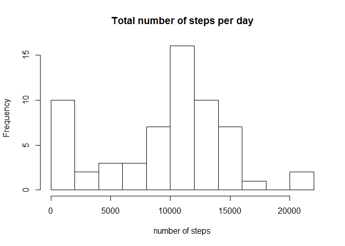
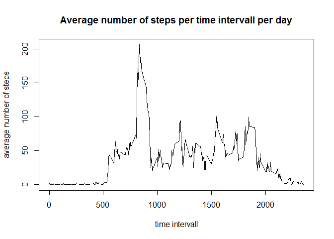
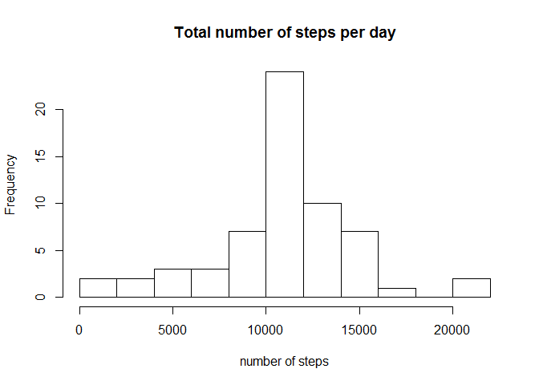

# Reproducible Research: Peer Assessment 1

## Info about the data

It is now possible to collect a large amount of data about personal movement 
using activity monitoring devices such as a Fitbit, Nike Fuelband, or Jawbone 
Up. These type of devices are part of the quantified self movement - a group 
of enthusiasts who take measurements about themselves regularly to improve their 
health, to find patterns in their behavior, or because they are tech geeks.
A personal activity monitoring device collects data at 5 minute intervals 
through out the day. The data consists of two months of data from an anonymous 
individual collected during the months of October and November, 2012 and include 
the number of steps taken in 5 minute intervals each day.

## Loading and preprocessing the data

The data was downloaded from the course website for Reproducible Research.
The date column is transformed into POSIXlt-class.


```
## [1] "English_United States.1252"
```


```r
activity <- read.csv("activity.csv")
```

## What is mean total number of steps taken per day?

The total number of steps per day are calculated and a histogram of the total 
number of steps taken each day is plotted.


```r
days <- group_by(activity, date)
s_days <- summarize(days, steps=sum(steps, na.rm = TRUE))
hist(s_days$steps, breaks = 10, main = "Total number of steps per day", 
     xlab = "number of steps")
```

 

The mean and median of the total number of steps is calculated.


```r
summarize(s_days, mean = mean(steps, na.rm = TRUE), 
          median = median(steps, na.rm = TRUE))
```

```
## Source: local data frame [1 x 2]
## 
##      mean median
## 1 9354.23  10395
```

## What is the average daily activity pattern?

The mean of the average number of steps per time intervall per day is taken and 
plotted.


```r
steps <- group_by(activity, interval)
a_steps <- summarize(steps, steps = mean(steps, na.rm = TRUE))
plot(a_steps$interval, a_steps$steps, type = "l", main = "Average number of steps per time intervall per day", xlab = "time intervall", ylab = "average number of steps")
```

 

The 5-minute interval, which contains the maximum number of steps, on average across all the days in the dataset, is calculated.


```r
a_steps[a_steps$steps == max(a_steps$steps),]
```

```
## Source: local data frame [1 x 2]
## 
##   interval    steps
## 1      835 206.1698
```

## Imputing missing values

Calculating the total number of rows with missing values in the dataset (since only in one column, the steps-column, there are missing values):


```r
sum(!complete.cases(activity))
```

```
## [1] 2304
```

The presence of missing values in the dataset may introduce bias into some calculations or summaries of the data. Therefore the missing values will be filled out by using the average for that 5-minute intervall. 


```r
# make a list of the missing values
steps.na <- activity$interval[is.na(activity$steps)]
# make index of location for missing values in a_steps
index <- sapply(steps.na, function(x) which(a_steps$interval == x))
# fill in missing values to create new dataset
activity$steps[is.na(activity$steps)] <- a_steps$steps[index]
```

A new histogram of the total number of steps per day is plotted with the new dataset.


```r
days <- group_by(activity, date)
s_days <- summarize(days, steps=sum(steps))
hist(s_days$steps, breaks = 10, main = "Total number of steps per day", 
     xlab = "number of steps")
```

 

```r
summarize(s_days, mean = mean(steps), median = median(steps))
```

```
## Source: local data frame [1 x 2]
## 
##       mean   median
## 1 10766.19 10766.19
```

Now, both the mean and the median of the dataset with the missing values inserted are higher than those in the dataset with the NA-values. In the new dataset mean and median values are equal, while in the original dataset they differed.

The histgram of the new data looks more like a normal distribtion, because the frequency of the very low values has gone down. The maximum frequency has increased. 

## Are there differences in activity patterns between weekdays and weekends?

A new factor is introduced into the dataset indicating whether a given day is a weekday or a weekend-day.


```r
activity$weekday <- weekdays(as.POSIXlt(activity$date),abbreviate = TRUE)
weekday <- data.frame(wd = c("Mon","Tue","Wed","Thu","Fri","Sat","Sun"), 
                      wc = c("weekday","weekday","weekday","weekday","weekday","weekend","weekend"))
ind <- sapply(activity$weekday, function(x) which(weekday$wd == x))
activity$weekday <- weekday$wc[ind]
steps <- group_by(activity, interval, weekday)
a_steps <- summarize(steps, steps = mean(steps))
g <- ggplot(a_steps, aes(interval,steps))
g + geom_line() + facet_grid(weekday~.) + labs(y="Number of steps") + labs(x="Interval")
```

 

The plot shows the difference in activity between weekdays and weekend days, by showing the average number of steps per time interval over all days.
